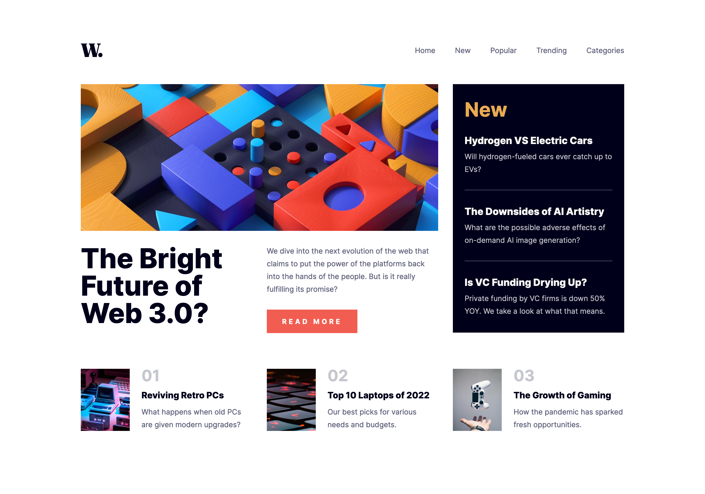

# News-Homepage

Premium [FrontEnd Mentor](https://www.frontendmentor.io/challenges) Challenge

# Welcome ! 👋

## Screenshot

### Links

- Live Site URL: [News Homepage](https://alexandre-st-news-homepage.netlify.app)

## Available scripts

In the project director, you can run :

### `yarn install`

### `yarn start`

## My process

### Built width :

- HTML5
- [SASS](https://sass-lang.com)
- Flexbox
- [ParcelJs](https://parceljs.org/)

## Author

- Frontend Mentor - [@Alexandre-st](https://www.frontendmentor.io/profile/Alexandre-st)
- Twitter - [@a_saintprix](https://twitter.com/a_saintprix)
